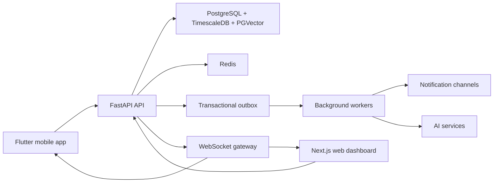

# Architecture Overview

## System Shape

Smart School Cloud ERP is a modular monorepo with three user-facing runtimes: FastAPI backend, Next.js web dashboard, and Flutter mobile app. PostgreSQL is the source of truth, with TimescaleDB for time-series workloads and PGVector for semantic AI retrieval. Redis supports cache, rate limiting, background coordination, and real-time fan-out.

## High-Level Components

## Backend Modules

- Identity and access: users, tenants, schools, roles, permissions, JWT sessions, and service accounts.
- School administration: school profile, academic years, terms, classes, rooms, and configuration.
- People records: students, teachers, parents, guardians, relationships, and enrollment.
- Attendance: capture events, daily summaries, face-assisted evidence, manual corrections, and audit trails.
- Notifications: durable notification records, preferences, templates, and WebSocket delivery.
- AI reporting: report requests, embeddings, source references, generated narratives, and review status.
- Scheduling: constraints, class sessions, teacher availability, rooms, and generated timetable proposals.
- Offline sync: device registrations, operation queues, conflict records, and revision cursors.

## Tenant Isolation

Every tenant-owned aggregate carries a tenant identifier. Service-layer methods require tenant context, database queries are scoped by tenant, and events include tenant metadata. Shared platform resources are modeled separately from school-owned resources.

## Event-Driven Pattern

State-changing commands write domain records and outbox events inside one database transaction. Workers process outbox events, perform side effects, and mark delivery attempts. This prevents notifications, sync fan-out, AI jobs, and integration messages from drifting away from committed state.

## CQRS Usage

CQRS is applied where read shape differs materially from write shape:

- Attendance summaries and dashboards.
- AI report read models.
- Notification inbox views.
- Scheduling proposal comparisons.

The default remains transactional CRUD with explicit service methods when CQRS would not simplify operations.
